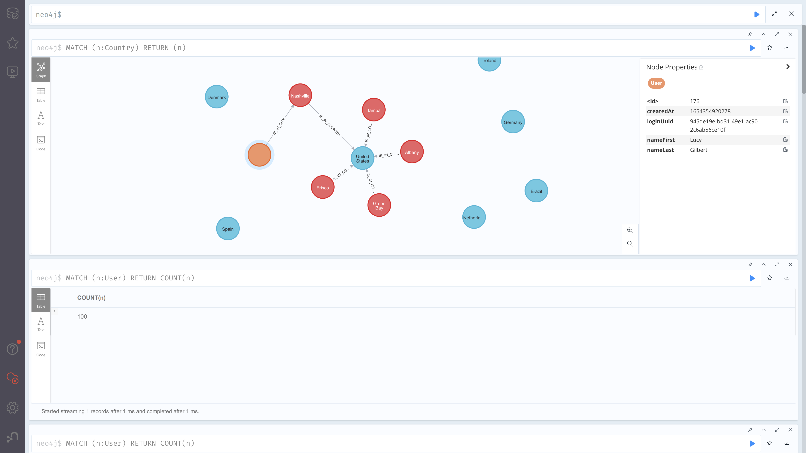

# nifi-randomuser-pipeline
This repo sets up and runs an nifi ETL pipeline (for background, see [wikipedia](https://en.wikipedia.org/wiki/Extract,_transform,_load) or [databricks](https://databricks.com/glossary/extract-transform-load)), taking random user data from an [api](https://randomuser.me/api/), building up CSVs that can be digested using neo4j's LOAD CSV, and then using LOAD CSV to send the data into a neo4j instance.

The demo can be configured using
```
# in services
docker-compose build
```
followed by
```
# in services
docker-compose up
```
There may be some permissions issues on the mount folders created by "docker-compose up"; if so, bring the services down, upgrade the perms on the created folders, and restart the services. There may also be timeouts on clearing down previous processing groups from the earlier containers. This can be fixed by clearing down the old containers, and starting the services
```
# in services
docker container prune; docker-compose build; docker-compose up
```

Once everything has started and settled down, the pipeline is visible on the [nifi page](http://localhost:8091/nifi) and the data warehouse on the [neo4j browser page](http://localhost:7474).

The services consist of
- nifi - docker image modified to use Java 11 and cypher-shell. Used for ETL orchestration.
- nifi registry
- neo4j - stock instance used as the destination for ETL pipeline
- nipyapi-demo - small python container that sets up ETL pipeline. The pipeline is entirely defined by the code in nipyapi-demo, which uses the nifi api to set up the pipeline from scratch (and so represents the pipeline as infrastructure-as-code)

The nifi services do tend to create a lot of volumes, and use up substantial CPU when running a full pipeline, so keep an eye on your resources and heat.

### Pipeline details

The raw data comes in from an [api](https://randomuser.me/api/). Each call to the API returns a [json](docs/randomuser-example.json).

Nifi regularly polls the api for 'new' data, processes it and sends the data into neo4j.


Using processors in nifi:
- jsons are pulled from the api (processor GetFile)
- each jsons is flattened (processor FlattenJson)
- records are merged into single csvs (processor MergeRecord)
- the csvs are sent to neo4j via LOAD CSV and cypher-shell (uses a groovy script in a neo4j ExecuteScript processor)
- old records are aged off using cypher-shell (uses a groovy script in a neo4j ExecuteScript processor)

The data landing can be seen in the neo4j browser


